# SmartFlight Use Case Activity Diagrams Reference
**Author:** Wong Cheng Yong  
**Project:** SmartFlight (F001 - F013)  
**Date:** May 2026  

This document contains official, highly detailed UML Activity Diagrams for all 6 core Use Cases (UC001 through UC006) defined in the design spec. The diagrams are represented in both **PlantUML** (featuring swimlanes for User/System distinction) and **Mermaid.js** (native state/flow representations), followed by step-by-step process narratives.

---

## UC001: Search Itinerary and View Risk

### Purpose
To enable the user to search for flight itineraries and see disruption and connection risk information before making a booking decision.

### PlantUML Activity Diagram (Swimlanes)

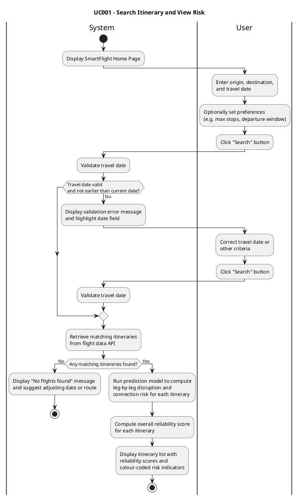

### UML Activity Diagram (Mermaid)

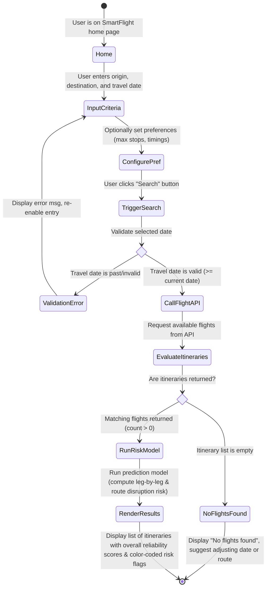

### Process Narrative
1. **User Action:** Enters the origin, destination, and travels dates on the home page. Specifies constraints like stops if desired.
2. **System Rules Check:** UI confirms date is current or future. If invalid, blocks execution and warns.
3. **External Gateway:** Calls the flight matching API.
4. **Disruption Assessment Layer:** For each match, feeds schedule variables through the reliability predictor to assign threat values.
5. **Display State:** Renders list view with color-coded safety indicators (Red, Yellow, Green status).

---

## UC002: View Flight Details

### Purpose
To enable the user to view full itinerary details and associated disruption and connection risk values for a selected search result.

### PlantUML Activity Diagram (Swimlanes)

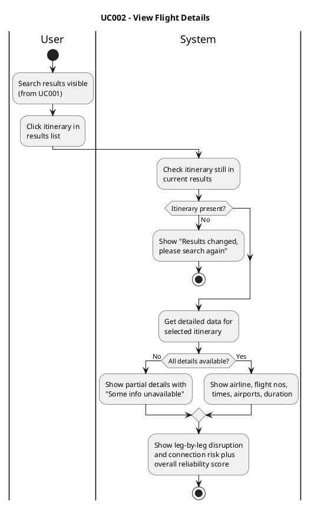

### UML Activity Diagram (Mermaid)

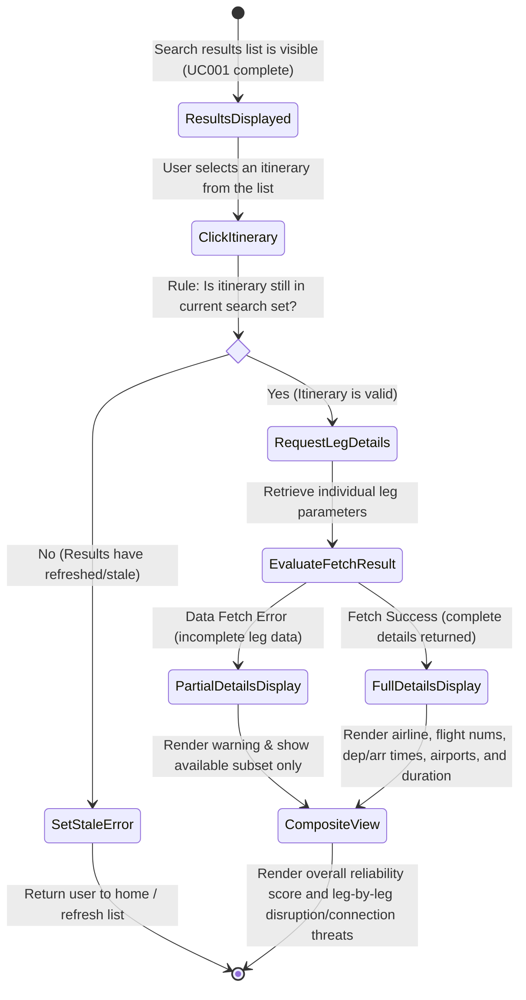

### Process Narrative
1. **User Action:** Clicks a specific itinerary card from the results list.
2. **Local Session Check:** Ensures selection exists in active UI cache.
3. **Data Retrieval:** Submits query for deep leg objects (tail numbers, terminal transfers, layover times).
4. **Exception Handling:** If API fails on subset of legs, falls back safely to displaying active static fields to avoid total screen failure.
5. **Diagnostic Display:** Shows visual layover connection nodes and risk parameters.

---

## UC003: Sort and Filter Results

### Purpose
To let the user organize and narrow down the list of itineraries according to personal preferences using the currently displayed search results.

### PlantUML Activity Diagram (Swimlanes)

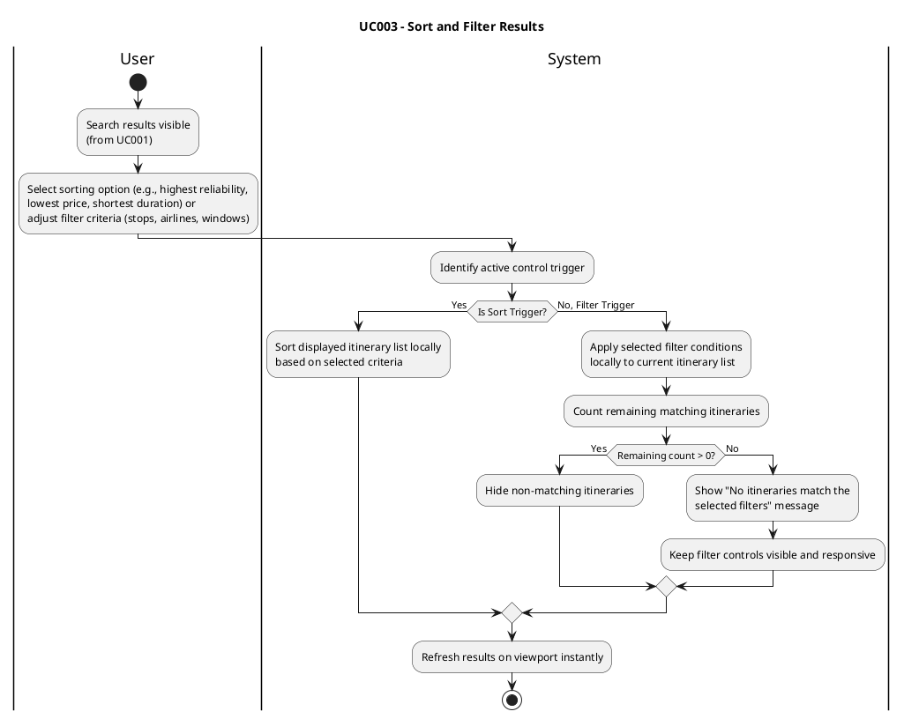

### UML Activity Diagram (Mermaid)

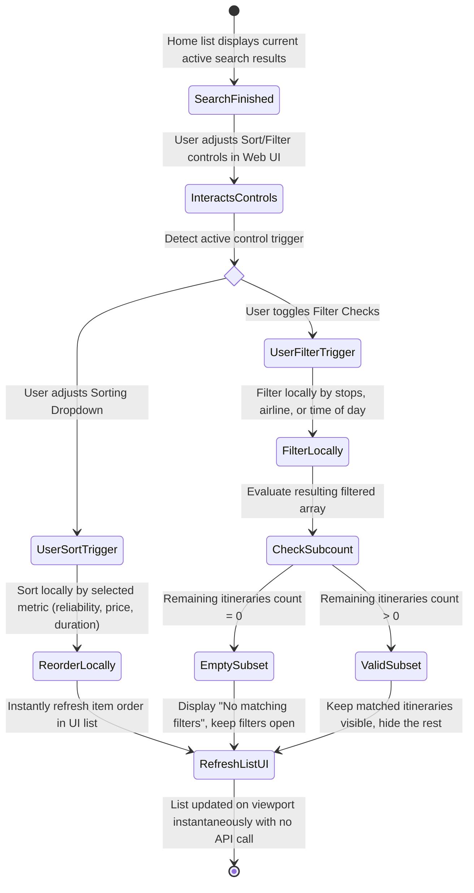

### Process Narrative
1. **User Action:** Initiates a sort alteration (e.g. price) or toggles checkboxes (e.g. direct flights).
2. **Processing Limitation Rule:** Done entirely client-side using stored state arrays without calling external APIs.
3. **Alternate Outcome:** If filters are over-restrictive, the system catches the zero-length result state and renders a "No matching filters" alert, keeping elements accessible to ease adjustments.

---

## UC004: View Alternative Itineraries

### Purpose
To enable the user to review better alternative itineraries from the current search results when a selected itinerary appears less favorable in terms of reliability or price.

### PlantUML Activity Diagram (Swimlanes)

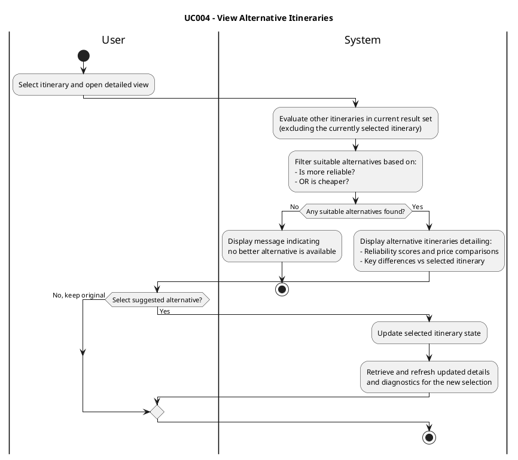

### UML Activity Diagram (Mermaid)

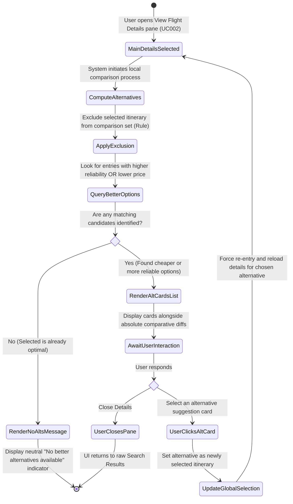

### Process Narrative
1. **Pre-processing Hook:** Upon showing details of flight `X`, the system extracts `X`'s cost and danger vectors.
2. **Comparison Logic:** Scans the remaining array subset. Filters records that have lower cost OR significantly better safety ratings.
3. **Comparative Display:** Shows alternative cards showing precisely what is saved (e.g., "+$40 saving", "+12% reliability").
4. **Navigation:** Allows instant swap click, treating the destination option as the new active focus.

---

## UC005: Save or Export Itinerary

### Purpose
To let the user save a selected itinerary to the system for later reference or export its details for external use when booking with airlines or travel agents.

### PlantUML Activity Diagram (Swimlanes)

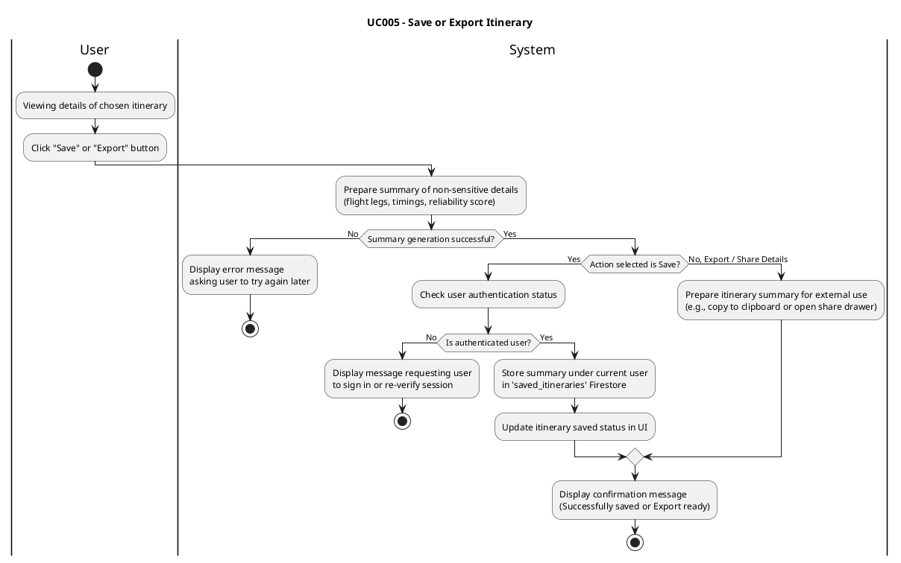

### UML Activity Diagram (Mermaid)

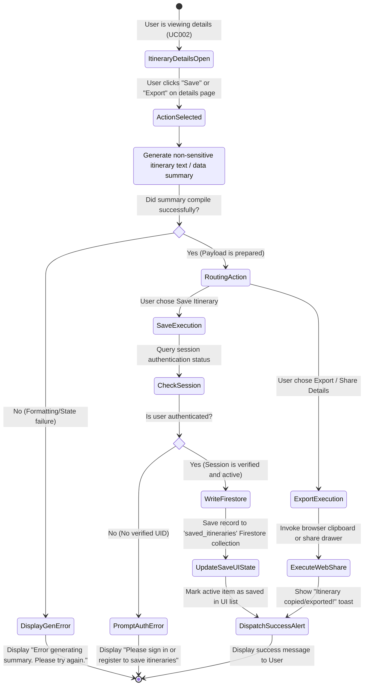

### Process Narrative
1. **Trigger:** User chooses to save (cloud bookmark) or export (clipboard copy/export).
2. **Cleansing filter:** Synthesizes a record containing times, airports, and scores. Excludes payment or credentials.
3. **Authentication Check:** If user chooses "Save In App", verifies active Firebase credential. If missing, blocks save and displays registration popover.
4. **Storage Phase:** Commits object to the cloud synced with user account id.

---

## UC006: Email Itinerary Summary

### Purpose
To allow the user to share or email a selected itinerary’s details and risk overview for later reference or external use through the device’s default email client.

### PlantUML Activity Diagram (Swimlanes)

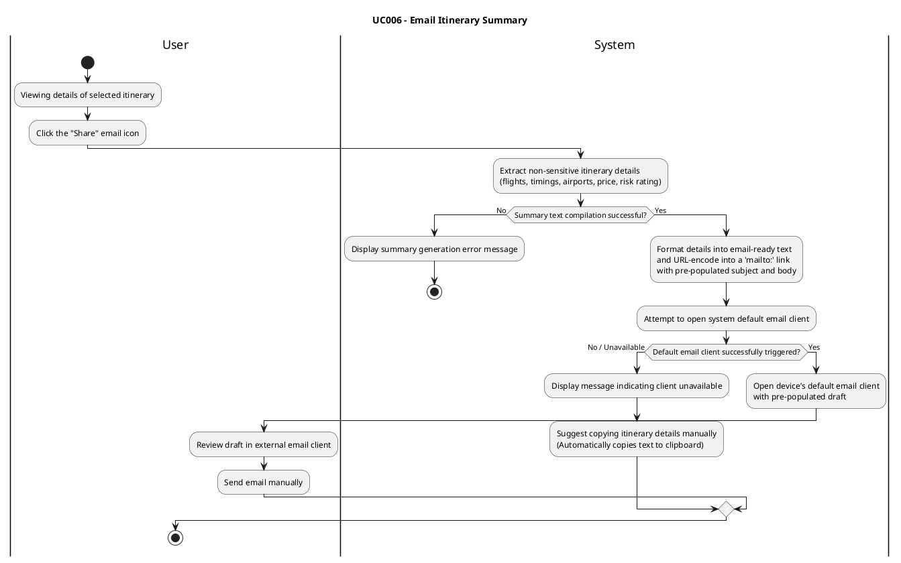

### UML Activity Diagram (Mermaid)

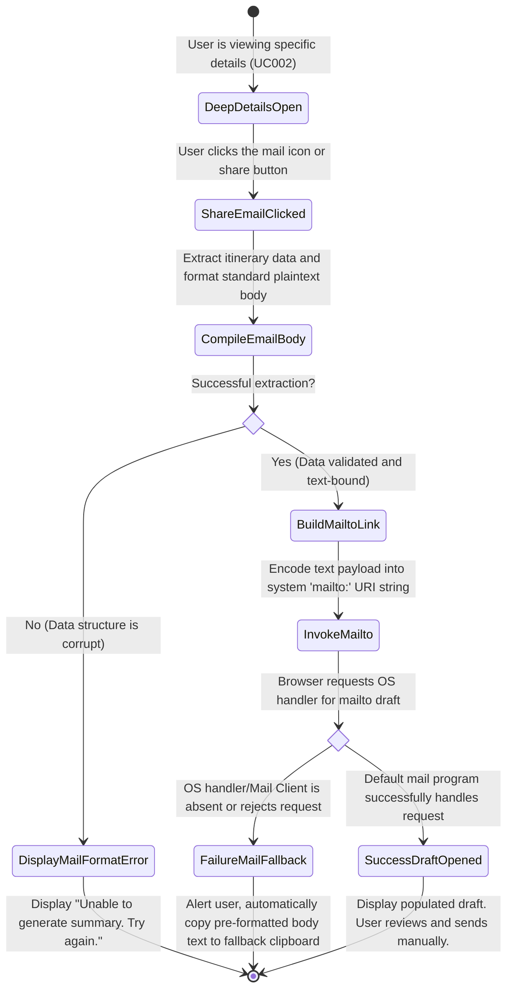

### Process Narrative
1. **Trigger:** User triggers standard email share hook on an itinerary detail card.
2. **Extraction Engine:** Compiles legible structural text comprising airport codes, flight numbers, transfer layovers, and reliability scores.
3. **Protocol Layer:** Forms a well-formed RFC 6068 `mailto:` URI, URL-encoding text into `%20`/`%0D%0A` formatting.
4. **Channel Execution:** Launches target URI in system runtime context. If no client is captured, invokes safety backup (dumps formatted summary straight to copyable clipboard to prevent process block).
5. **Closure:** Handed off to device mail application where the user makes the final "Send" action.
